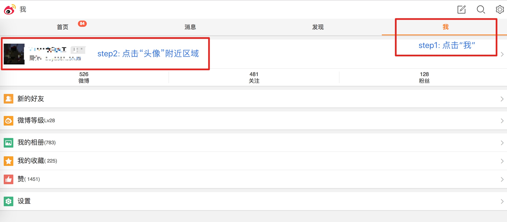

## 微博备份脚本


### Prerequisites

**Python 3.6**

### Installing

1. Clone this repository

    ```bash
    cd /path/to/anywhere/you/like
    git clone https://github.com/zengyu714/weibo-backup
    ```
    Now the directory looks like
    
    ```bash
    .
    ├── README.md
    ├── configuration.example.py
    ├── main.py
    ├── requirements.txt
    ├── demo  [directory]
    └── pages [directory]
        └── README.md
 
    ```
    
2. Install dependencies

    ```python
    pip install -r requirements.txt
    ```

### Running
1. 修改配置文件`configuration.example.py`
    + `CONFIG.url_template`
        1. 登录微博[触屏版](https://m.weibo.cn/)
            
            得到**URL**, E.g, [https://m.weibo.cn/u/2146965345](https://m.weibo.cn/u/2146965345)
        2. 点击进入，打开浏览器调试工具
        
        
        3. 将复制得到的`Request URL`粘贴到
        `CONFIG.url_template = `'**your_url**'
        E.g.,  
        `CONFIG.url_template = 'https://m.weibo.cn/api/container/getIndex?type=uid&value=2146965345&containerid=1076032146965345'`
    + `CONFIG.cookie` 
        1. 同样是在调试界面，在`Headers`栏往下翻到`Cookie` 
        
        2. 右键复制内容（目的是发送登录状态）
        3. 将复制得到的`Cookie`粘贴到
        `CONFIG.cookie = `'**your_cookie**'
        
1. 将配置文件名称由`configuration.example.py`改成`configuration.py`
    ```bash
    mv configuration.example.py configuration.py
    ```
1. 运行`main.py`脚本
    ```python
        python main.py
    ```

**Note**
+ 生成`pages`文件夹保存微博json文件
+ 生成**结果文件**`mblog_backup_<current_date>.html`,可以在浏览器打开并打印成PDF

### Contributions
- [x] 对于长文(>140)，评论，点赞详情没有记录
- [x] 优化备份页面排版

### License
This project is licensed under the MIT License

### Reference
[https://www.zhihu.com/question/20339936](https://www.zhihu.com/question/20339936)